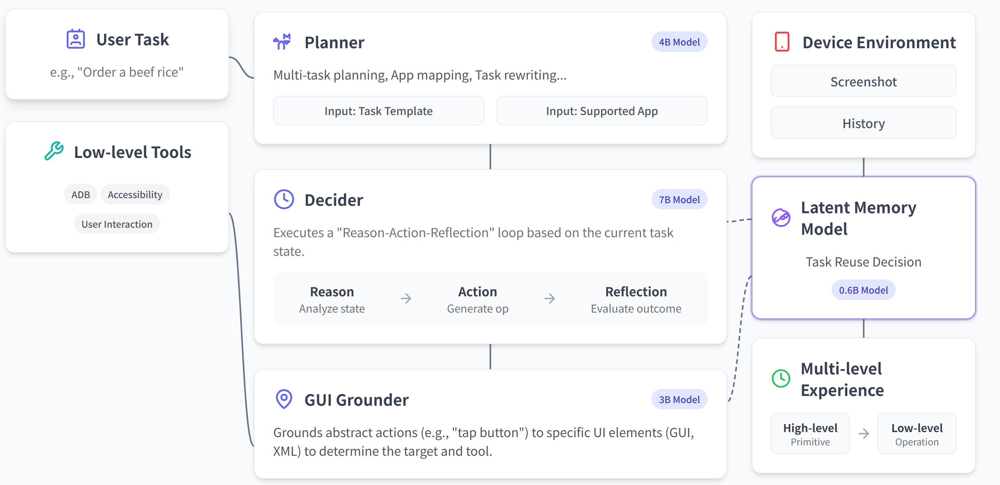

<div align="center">
  <picture>
    
  </picture>
</div>

<h3 align="center">
MobiAgent: A Systematic Framework for Customizable Mobile Agents
</h3>

<p align="center">
| <a href="https://arxiv.org/"><b>Paper</b></a> | <a href="https://huggingface.co/collections/IPADS-SAI/mobimind-68b2aad150ccafd9d9e10e4d"><b>Huggingface</b></a> | <a href="https://github.com/IPADS-SAI/MobiAgent/releases/tag/v1.0"><b>App</b></a> |
</p> 

<p align="center">
 <strong>English</strong> | <a href="README_zh.md">中文</a>
</p> 

---

## About

**MobiAgent** is a powerful and customizable mobile agent system including:

* **An agent model family**: MobiMind
* **An agent acceleration framework**: AgentRR
* **An agent benchmark**: MobiFlow

**System Architecture:**

<div align="center">
<p align="center">
  
</p>
</div>

## News

- `[2025.8.30]`🔥 We've open-sourced the MobiAgent!

## Evaluation Results

<div align="center">
<p align="center">
  
  
  
</p>
</div>

<div align="center">
<p align="center">
  
</p>
</div>

## Demo

Mobile App Demo:
<div align="center">
  <video src="https://github.com/user-attachments/assets/3a6539ea-34a5-4073-93aa-18986ca065ff"/>
</div>

AgentRR Demo (Left: first task; Right: subsequent task)
<div align="center">
  <video src="https://github.com/user-attachments/assets/ef5268a2-2e9c-489c-b8a7-828f00ec3ed1"/>
</div>

## Project Structure

- `agent_rr/` - Agent Record & Replay framework
- `collect/` - Data collection, annotation, processing and export tools
- `runner/` - Agent executor that connects to phone via ADB, executes tasks, and records execution traces
- `MobiFlow/` - Agent evaluation benchmark based on milestone DAG
- `app` - MobiAgent Android app
- `deployment/` - Service deployment for MobiAgent mobile application

## Quick Start

### Use with MobiAgent APP

If you would like to try MobiAgent directly with our APP, please download it in [Download Link](https://github.com/IPADS-SAI/MobiAgent/releases/tag/v1.0) and enjoy yourself!

### Use with Python Scripts

If you would like to try MobiAgent with python scripts which leverage Android Debug Bridge (ADB) to control your phone, please follow these steps:

#### Environment Setup

```bash
conda create -n MobiMind python=3.10
conda activate MobiMind

pip install -r requirements.txt

# Download OmniParser model weights
for f in icon_detect/{train_args.yaml,model.pt,model.yaml} ; do huggingface-cli download microsoft/OmniParser-v2.0 "$f" --local-dir weights; done

# If you need GPU acceleration for OCR, install paddlepaddle-gpu according to your CUDA version
# For details, refer to https://www.paddlepaddle.org.cn/install/quick, for example CUDA 11.8:
python -m pip install paddlepaddle-gpu==3.1.0 -i https://www.paddlepaddle.org.cn/packages/stable/cu118/

```

#### Mobile Device Setup

- Download and install [ADBKeyboard](https://github.com/senzhk/ADBKeyBoard/blob/master/ADBKeyboard.apk) on your Android device
- Enable Developer Options on your Android device and allow USB debugging
- Connect your phone to the computer using a USB cable

#### Model Deployment

After downloading the `decider`, `grounder`, and `planner` models, use vLLM to deploy model inference services:

```bash
vllm serve IPADS-SAI/MobiMind-Decider-7B --port <decider port>
vllm serve IPADS-SAI/MobiMind-Grounder-3B --port <grounder port>
vllm serve Qwen/Qwen3-4B-Instruct --port <planner port>
```


#### Launch Agent Runner

Write the list of tasks that you would like to test in `runner/mobiagent/task.json`, then launch agent runner:

```bash
python -m runner.mobiagent.mobiagent --service_ip <Service IP> --decider_port <Decider Service Port> --grounder_port <Grounder Service Port> --planner_port <Planner Service Port>
```

Parameters:

- `--service_ip`: Service IP (default: `localhost`)
- `--decider_port`: Decider service port (default: `8000`)
- `--grounder_port`: Grounder service port (default: `8001`)
- `--planner_port`: Planner service port (default: `8002`)

The runner automatically controls the device and invoke agent models to complete the pre-defined tasks.

## Detailed Sub-module Usage

For detailed usage instructions, see the `README.md` files in each sub-module directory.
