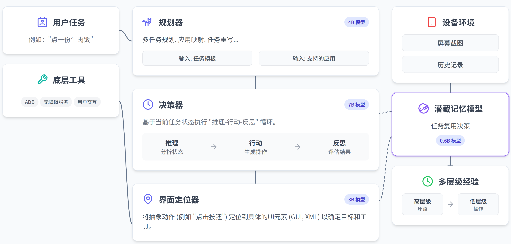
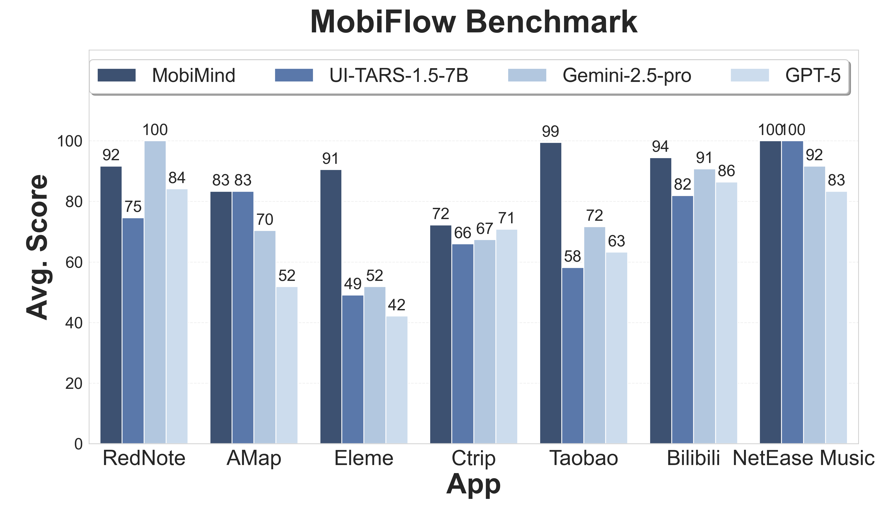
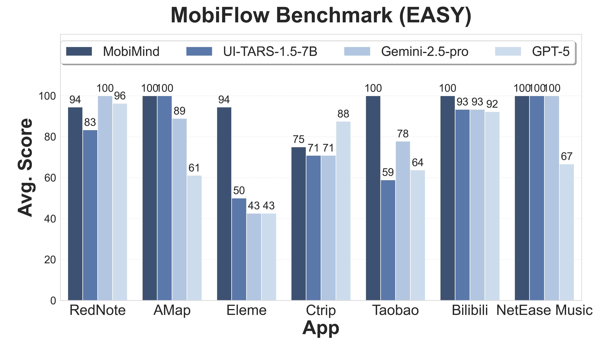
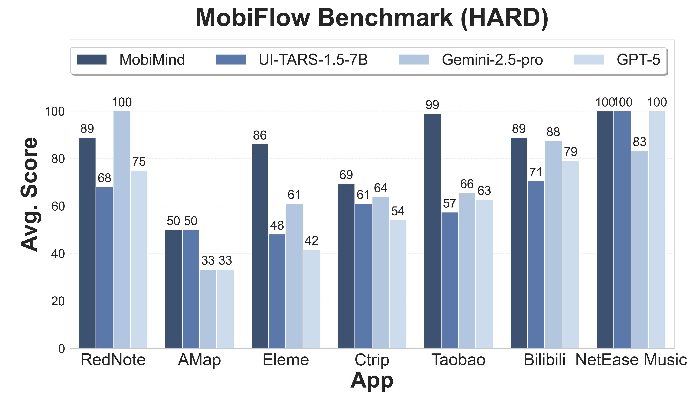
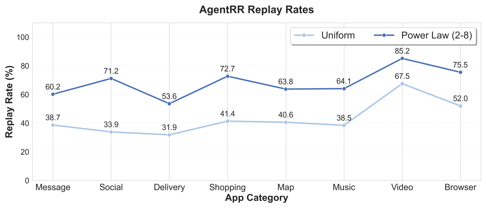

<div align="center">
  <picture>
    
  </picture>
</div>

<h3 align="center">
MobiAgent: A Systematic Framework for Customizable Mobile Agents
</h3>

<p align="center">
| <a href="https://arxiv.org/abs/2509.00531"><b>论文</b></a> | <a href="https://huggingface.co/collections/IPADS-SAI/mobimind-68b2aad150ccafd9d9e10e4d"><b>Huggingface</b></a> | <a href="https://github.com/IPADS-SAI/MobiAgent/releases/tag/v1.0"><b>App</b></a> |
</p> 

<p align="center">
 <a href="README.md">English</a> | <strong>中文</strong>
</p> 

---

## 简介

**MobiAgent**是一个强大的、可定制的移动端智能体系统，包含：

* **智能体模型家族：** MobiMind
* **智能体加速框架：** AgentRR
* **智能体评测基准：** MobiFlow

**系统架构**:

<div align="center">
<p align="center">
  
</p>
</div>

## 新闻

- `[2025.8.30]`🔥 我们开源了MobiAgent！

## 评测结果

<div align="center">
<p align="center">
  
  
  
</p>
</div>

<div align="center">
<p align="center">
  
</p>
</div>

## 项目结构

- `agent_rr/` - Agent Record & Replay框架
- `collect/` - 数据收集、标注、处理与导出工具
- `runner/` - 智能体执行器，通过ADB连接手机、执行任务、并记录执行轨迹
- `MobiFlow/` - 基于里程碑DAG的智能体评测基准
- `app/` - MobiAgent安卓App
- `deployment/` - MobiAgent移动端应用的服务部署方式

## 快速开始

### 通过 MobiAgent APP 使用

如果您想直接通过我们的 APP 体验 MobiAgent，请通过 [下载链接](https://github.com/IPADS-SAI/MobiAgent/releases/tag/v1.0) 进行下载，祝您使用愉快！

### 使用 Python 脚本

如果您想通过 Python 脚本来使用 MobiAgent，并借助Android Debug Bridge (ADB) 来控制您的手机，请遵循以下步骤进行：

#### 环境配置

```bash
conda create -n MobiMind python=3.10
conda activate MobiMind

pip install -r requirements.txt

# 下载OmniParser模型权重
for f in icon_detect/{train_args.yaml,model.pt,model.yaml} ; do huggingface-cli download microsoft/OmniParser-v2.0 "$f" --local-dir weights; done

# 如果需要使用gpu加速ocr，需要根据cuda版本，手动安装paddlepaddle-gpu
# 详情参考 https://www.paddlepaddle.org.cn/install/quick，例如cuda 11.8版本：
python -m pip install paddlepaddle-gpu==3.1.0 -i https://www.paddlepaddle.org.cn/packages/stable/cu118/

```

#### 手机配置

- 在Android设备上下载并安装 [ADBKeyboard](https://github.com/senzhk/ADBKeyBoard/blob/master/ADBKeyboard.apk)
- 在Android设备上，开启开发者选项，并允许USB调试
- 使用USB数据线连接手机和电脑

#### 模型部署

下载好 `decider`、`grounder` 和 `planner` 三个模型后，使用 vLLM 部署模型推理服务：

```bash
vllm serve IPADS-SAI/MobiMind-Decider-7B --port <decider port>
vllm serve IPADS-SAI/MobiMind-Grounder-3B --port <grounder port>
vllm serve Qwen/Qwen3-4B-Instruct --port <planner port>
```

#### 启动Agent执行器

在 `runner/mobiagent/task.json` 中写入想要测试的任务列表，然后启动Agent执行器

```bash
python -m runner.mobiagent.mobiagent --service_ip <服务IP> --decider_port <决策服务端口> --grounder_port <定位服务端口> --planner_port <规划服务端口>
```

**参数说明**

- `--service_ip`：服务IP（默认：`localhost`）
- `--decider_port`：决策服务端口（默认：`8000`）
- `--grounder_port`：定位服务端口（默认：`8001`）
- `--planner_port`：规划服务端口（默认：`8002`）

执行器启动后，将会自动控制手机并调用Agent模型，完成列表中指定的任务。

## 子模块详细使用方式

详细使用方式见各子模块目录下的 `README.md` 文件。
